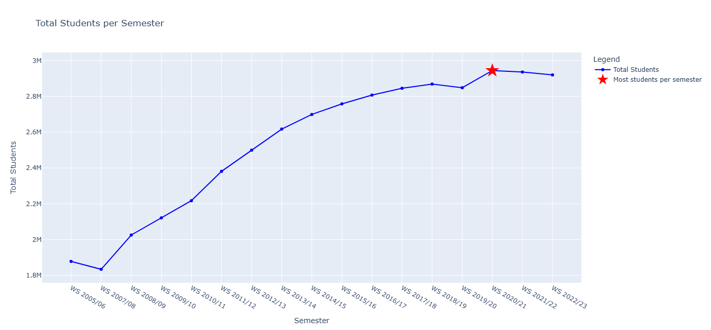
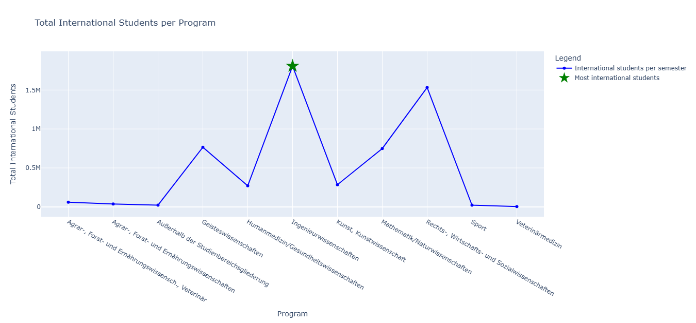
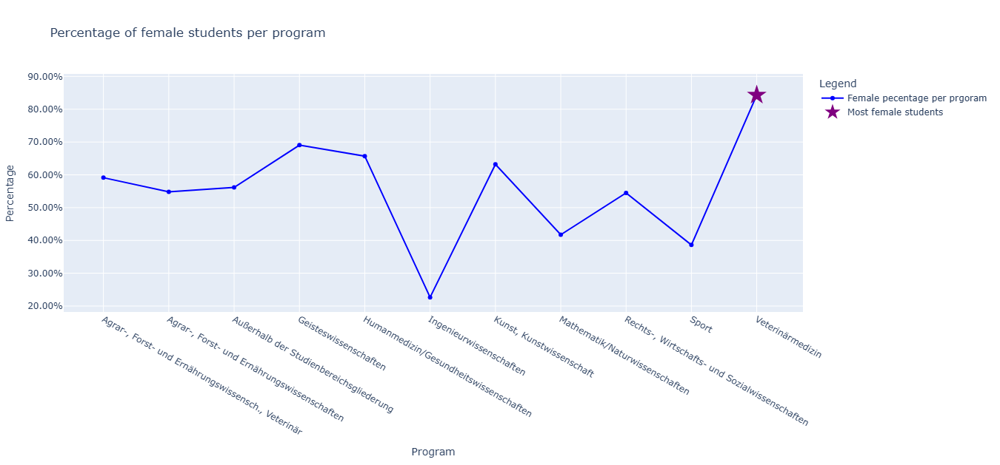

Hosted [here](https://german-uni-students.streamlit.app/) on Streamlit

---

###  Tab 1: (Aufgabe 1 von 3): Das Semester mit den meisten Studenten

###  Tab 2: Dynamisches Studentendiagramm

###  Tab 3: Choroplethenkarte von Studenten

---

Used [German states](https://github.com/isellsoap/deutschlandGeoJSON/blob/main/2_bundeslaender/2_hoch.geo.json) from this [Repository](https://github.com/isellsoap/deutschlandGeoJSON) for the student distribution.

Inspired and guided by the following [Repository](https://github.com/dataprofessor/population-dashboard)

---

# 🎓 Bildung in Deutschland: Studierendenzahlen 2005–2022

## 🇩🇪

Dieses Repository enthält ein Datenset mit Studierendenzahlen an deutschen Hochschulen im Zeitraum von **2005 bis 2022**.  
Die Daten stammen vom **Statistischen Bundesamt (Destatis)** und ermöglichen detaillierte Analysen zu Entwicklungen im deutschen Hochschulsystem.

### 📂 Inhalt

Die Datei `Bildung.xlsx` enthält folgende Informationen pro Semester:

- Semester (z. B. WS 2022/23)
- Bundesland
- Hochschulart (z. B. Universität, Fachhochschule)
- Studienbereich (z. B. Ingenieurwissenschaften)
- Trägerschaft (öffentlich / privat)
- Anzahl Studierender, getrennt nach:
  - Geschlecht (männlich / weiblich)
  - Herkunft (deutsch / international)

### 🎯 Anwendungsbeispiele

- Entwicklung der Gesamtstudierendenzahlen
- Vergleich von Studienfächern über die Jahre
- Analyse des Anteils internationaler Studierender
- Regionale Unterschiede zwischen Bundesländern
- Data Exploration mit Tools wie Python, SQL oder KI-Systemen (z. B. Genie AI)

---

## 🇬🇧

This repository contains a dataset on university students in Germany from **2005 to 2022**, sourced from the **Statistischen Bundesamt (Destatis)**.

### 📂 Contents

The file `Bildung.xlsx` includes the following information per semester:

- Semester (e.g., WS 2022/23)
- Federal State
- Type of Institution (e.g., university, applied sciences)
- Field of Study (e.g., engineering)
- Sponsorship (public / private)
- Number of students by:
  - Gender (male / female)
  - Nationality (German / international)

### 🎯 Example Use Cases

- Trend analysis of student population over time
- Comparison of academic fields
- Exploring the rise of international students
- Regional differences across states
- Data exploration with Python, SQL or AI tools (e.g., Genie AI)

---

## 📄 Quelle / Source

> Offizielle Daten von [GENESIS-Online – Statistisches Bundesamt (Destatis)]([https://www-genesis.destatis.de/](https://www-genesis.destatis.de/datenbank/online/statistic/21311/table/21311-0006/chart/column#chartFilter=JTdCJTIyZGlhZ3JhbVR5cGUlMjIlM0ElMjJjb2x1bW4lMjIlMkMlMjJjb250ZW50JTIyJTNBJTIyQklMMDAyJTI0UU1VJTIyJTJDJTIyeEF4aXNWYXJpYWJsZXMlMjIlM0ElNUIlMjJETEFORCUyMiU1RCUyQyUyMnhBeGlzVmFyaWFibGVWYWx1ZXMlMjIlM0ElNUIlMjIwOCUyMiUyQyUyMjA5JTIyJTJDJTIyMTElMjIlMkMlMjIxMiUyMiUyQyUyMjA0JTIyJTJDJTIyMTMlMjIlMkMlMjIwMyUyMiUyQyUyMjA2JTIyJTJDJTIyMDIlMjIlMkMlMjIwNyUyMiUyQyUyMjEwJTIyJTJDJTIyMDUlMjIlMkMlMjIxNSUyMiUyQyUyMjAxJTIyJTJDJTIyMTQlMjIlMkMlMjIxNiUyMiU1RCUyQyUyMnRhYmxlQ29kZSUyMiUzQSUyMjIxMzExLTAwMDYlMjIlMkMlMjJjdXJ2ZXNHcm91cHMlMjIlM0ElNUIlN0IlMjJjdWJlJTIyJTNBJTIyRFNfMDAxJTIyJTJDJTIyY3VydmVzJTIyJTNBJTVCJTdCJTIyY29sb3IlMjIlM0ElMjIlMjMwMDYyOTglMjIlMkMlMjJ2aXNpYmxlJTIyJTNBdHJ1ZSUyQyUyMmRhdGFTcGVjaWZpY2F0aW9uJTIyJTNBJTdCJTIyc2VsZWN0ZWRWYXJpYWJsZXNWYWx1ZXMlMjIlM0ElN0IlMjJOQVQlMjIlM0ElMjIlMjVUT1RBTCUyNSUyMiUyQyUyMkdFUyUyMiUzQSUyMiUyNVRPVEFMJTI1JTIyJTJDJTIyU0VNRVNUJTIyJTNBJTIyMjAyMy0xMFA2TSUyMiUyQyUyMkJJTFNGMSUyMiUzQSUyMlNGNTQ4JTIyJTdEJTJDJTIyY3VycmVudE1haW5WYXJpYWJsZSUyMiUzQSUyMkRMQU5EJTIyJTJDJTIyY3VycmVudE1haW5WYXJpYWJsZVZhbHVlcyUyMiUzQSU1QiUyMjA4JTIyJTJDJTIyMDklMjIlMkMlMjIxMSUyMiUyQyUyMjEyJTIyJTJDJTIyMDQlMjIlMkMlMjIxMyUyMiUyQyUyMjAzJTIyJTJDJTIyMDYlMjIlMkMlMjIwMiUyMiUyQyUyMjA3JTIyJTJDJTIyMTAlMjIlMkMlMjIwNSUyMiUyQyUyMjE1JTIyJTJDJTIyMDElMjIlMkMlMjIxNCUyMiUyQyUyMjE2JTIyJTVEJTdEJTdEJTVEJTJDJTIyZml4ZWRWYXJpYWJsZXNWYWx1ZXMlMjIlM0ElN0IlMjJzdGF0aXN0aWMlMjIlM0ElMjIyMTMxMSUyMiU3RCU3RCU1RCU3RA==))

---

## 📥 Nutzung / Download

Einfach `Bildung.xlsx` bzw. `Bildung.csv` herunterladen – keine Anmeldung bei GitHub erforderlich, deoch empfelenswert sich mit dem Tool auseinander zu setzen 😎.

